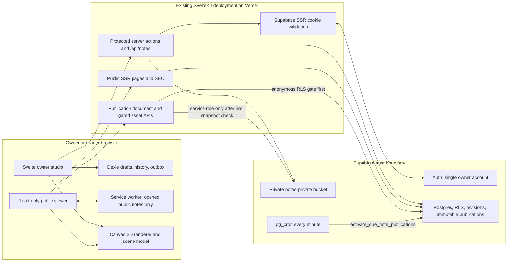
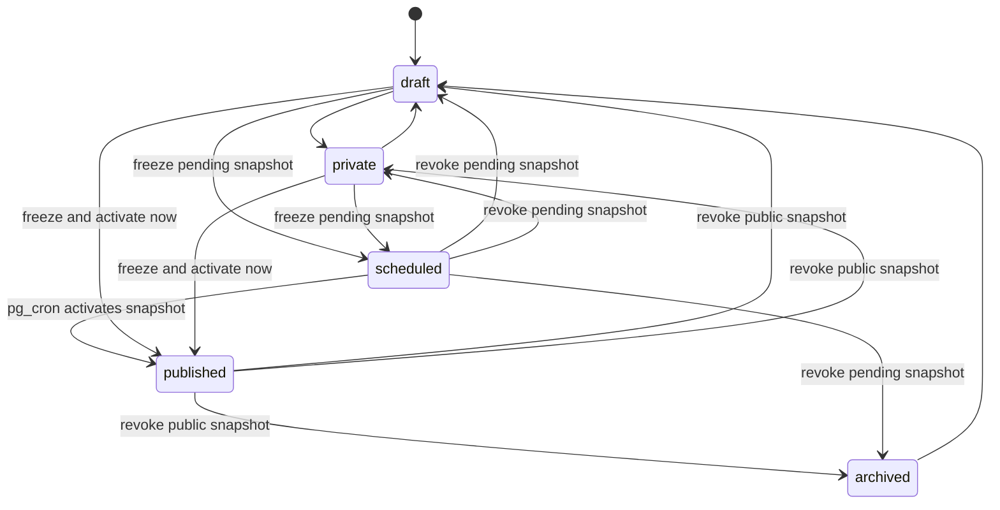

This document describes the implementation in this repository as of 23 July 2026. “Shipped” means
the code exists in the repository; production-dependent behaviour still requires the Supabase
migration, secrets, owner account, cron job, and Vercel deployment described below.

# 1. Assumptions and questions that materially affect the architecture

The implementation makes these deliberate assumptions:

- There is exactly one author. The author is identified by one immutable Supabase Auth user UUID,
  checked both against `NOTES_OWNER_USER_ID` and the `note_owners` table. Adding a team later would
  require an explicit membership/role model rather than reusing this single-owner shortcut.
- The existing SvelteKit application and its Vercel deployment remain the application boundary.
  Notes are a section of SuvroGhosh.IN, not a separately deployed application.
- Supabase is acceptable for Postgres, password authentication, private object storage, row-level
  security, and the one-minute scheduled-publication job.
- A publication is a frozen edition. Editing the private working document never mutates what a
  reader is seeing; publishing again creates a new immutable snapshot.
- Scheduled publication freezes the canvas and metadata when it is scheduled. If the owner edits
  the private document afterwards, the schedule must be replaced to publish those changes.
- The public transcript is owner-authored. Automatic handwriting recognition is optional and is
  not part of the current release.
- World coordinates are effectively unbounded for normal use but are validated to ±10,000,000
  units. This protects geometry, storage, and rendering from pathological numeric input.
- The current canonical domain is `https://www.suvroghosh.in`. Production and preview
  environments must use separate Supabase projects or, at minimum, separate owner/data policies.

Questions to settle before calling the production rollout complete:

1. What is the supported authoring device matrix: Apple Pencil/Safari, Samsung S Pen/Chrome,
   Surface Pen/Edge, and which touch-only phones?
2. Should a scheduled note publish the frozen scheduling-time edition, as implemented, or the
   latest saved edition at activation time? The frozen edition is safer and auditable.
3. What retention policy is required for archived notes, deleted notes, publication snapshots,
   and orphaned image blobs?
4. Which Supabase region and paid backup/PITR plan meet the desired recovery time and data
   residency requirements?
5. Should external HTTPS cover images remain allowed, or should covers also be copied into the
   managed private asset pipeline to remove third-party tracking and availability risk?

Current, explicitly accepted limitations:

- Advanced stylus fields vary by browser and hardware. Pressure has a stable fallback; tilt,
  twist, azimuth, altitude, tangential pressure, and barrel buttons are progressive enhancements.
- Direct pointer resize/rotate handles are not yet wired. Selected objects can be moved by drag and
  resized or rotated precisely with accessible numeric controls.
- Touch never lays ink by default: two fingers pan/pinch, while pen or mouse writes. In Select
  mode, one finger can select and move a writing/image tile; a one-finger drag on blank space pans.
  An explicit toolbar toggle enables finger drawing and object placement on touch-only phones while
  making its gesture/palm-rejection trade-off visible.
- Blank, dotted, grid, and lined paper plus any solid paper colour are shipped. A managed custom
  texture is not; a locked image/tile can currently emulate one.
- Public metadata loads before the canvas document, and objects are viewport-culled, but very large
  documents are not yet transported in independently fetchable chunks.
- OCR, server-side background export, realtime collaboration, and WebGPU rendering are not
  implemented.
- A reader who has already downloaded or cached a publication can retain it while offline after it
  is unpublished. No web system can recall data already delivered to a client.

# 2. Recommended technology stack, reasons, and current alternatives

The repository uses stable, production-oriented packages with permissive licences. Versions below
are the versions currently declared in `package.json`, not a promise to upgrade automatically.

| Concern                | Implemented choice                                    | Why it fits                                                                                                                        | Practical alternative                                                                         |
| ---------------------- | ----------------------------------------------------- | ---------------------------------------------------------------------------------------------------------------------------------- | --------------------------------------------------------------------------------------------- |
| Application            | SvelteKit 2.50, Svelte 5.54, strict TypeScript        | Preserves the existing site, SSR, form actions, server routes, prerender-safe CSP integration, and Vercel adapter                  | A separate SPA would duplicate navigation, SEO, auth, and deployment concerns                 |
| Ink surface            | Canvas 2D                                             | Broad browser support, low setup cost, efficient immediate-mode drawing, and predictable export behaviour                          | WebGL for larger GPU-batched scenes; SVG for small, highly semantic diagrams                  |
| Stroke outline         | `perfect-freehand` 1.2                                | Small, framework-neutral stroke geometry; MIT licensed                                                                             | A custom spline/brush engine gives more control but considerably more testing and maintenance |
| Scene index            | Repository-owned 512-unit uniform grid                | Infinite whiteboards normally contain clustered, similarly sized objects; no dependency or worker boundary is needed at this scale | RBush/R-tree for highly irregular object distributions                                        |
| Validation             | Zod 4.4 plus Postgres constraints                     | One strict runtime schema for imports and API writes, with database limits as the final boundary                                   | Valibot is smaller; JSON Schema is better for cross-language clients                          |
| Auth/session           | Supabase Auth with `@supabase/ssr` and secure cookies | Verified server sessions, password auth, refresh-cookie handling, and one provider for RLS                                         | Auth.js plus a separate Postgres/storage provider                                             |
| Database/search        | Supabase Postgres, JSONB, RLS, generated `tsvector`   | Transactional revisions and publication snapshots, server-enforced authorization, full-text search                                 | Managed Postgres elsewhere plus custom session and storage policies                           |
| Image storage          | Private Supabase Storage bucket                       | A publication-aware server gate can revoke future reads; object paths never become public bucket URLs                              | S3/R2 with signed URLs and an asset authorization service                                     |
| Offline drafts         | Dexie 4.4 over IndexedDB                              | Indexed, transactional browser persistence with a small typed wrapper; Apache-2.0 licensed                                         | Raw IndexedDB avoids a dependency but is much more verbose and error-prone                    |
| Image sanitation       | Sharp 0.35/libvips                                    | Full server decode and WebP re-encode strips metadata, animation, and trailing/polyglot content; Apache-2.0 licensed               | A separate image proxy/service for larger workloads                                           |
| PDF export             | jsPDF 4.2                                             | Reliable client-side PDF generation without sending private drafts to a worker service; MIT licensed                               | Server-side Playwright/PDF rendering for queued, very large exports                           |
| Offline public reading | SvelteKit service worker and Cache API                | Integrates with the build manifest and caches only opened public content                                                           | Workbox provides richer policies but adds abstraction and bundle weight                       |
| Testing                | Vitest 4 plus Svelte/TypeScript checks                | Fast unit coverage of the model, geometry, index, history, schema, and exports                                                     | Playwright is recommended in Release 2 for browser workflows                                  |
| Hosting                | Existing `@sveltejs/adapter-vercel` deployment        | No platform migration, established headers/analytics, and SSR functions already fit the site                                       | A container or long-running Node host if export queues become server-side                     |

Primary documentation and maintenance references:

- [SvelteKit documentation](https://svelte.dev/docs/kit/introduction) and
  [SvelteKit service workers](https://svelte.dev/docs/kit/service-workers)
- [`perfect-freehand` source, API, and MIT licence](https://github.com/steveruizok/perfect-freehand)
- [Dexie documentation](https://dexie.org/docs)
- [Supabase server-side client guidance](https://supabase.com/docs/guides/auth/server-side/creating-a-client),
  [row-level security](https://supabase.com/docs/guides/database/postgres/row-level-security),
  [Storage access control](https://supabase.com/docs/guides/storage/security/access-control), and
  [Supabase Cron](https://supabase.com/docs/guides/cron)
- [Pointer Events](https://developer.mozilla.org/en-US/docs/Web/API/PointerEvent) and
  [`getCoalescedEvents()` compatibility](https://developer.mozilla.org/en-US/docs/Web/API/PointerEvent/getCoalescedEvents)
- [Sharp documentation](https://sharp.pixelplumbing.com/) and
  [jsPDF source/documentation](https://github.com/parallax/jsPDF)
- [Vercel Functions limits](https://vercel.com/docs/functions/limitations)

### Canvas 2D, SVG, WebGL, WebGPU, and hybrid trade-offs

Canvas 2D is the production baseline because it has the most consistent mobile support and handles
thousands of culled objects without a retained DOM node per mark. Its costs are that accessibility,
hit testing, and retained object state must be implemented separately; this repository does all
three.

SVG is excellent for export and small diagrams because paths remain inspectable and resolution
independent. It becomes expensive when thousands of live stroke nodes trigger DOM/style/layout
work, so SVG is an export format here rather than the editor surface.

WebGL can batch many paths and textures efficiently but needs tessellation, atlas/resource
management, context-loss recovery, and a Canvas 2D or static fallback. It is a reasonable advanced
renderer after profiling demonstrates a Canvas 2D bottleneck.

WebGPU is not a safe baseline because browser/OS coverage and implementation details still differ.
It may eventually power optional effects or very large documents, but it must remain progressive
enhancement.

A hybrid architecture—Canvas 2D now, DOM controls and accessible transcript around it, SVG/PDF/PNG
exports—delivers the best present balance. The document model and renderer are separate so a WebGL
renderer can be added without changing persisted notes.

# 3. High-level system architecture



Trust boundaries are intentionally asymmetric:

- The owner browser is never trusted to decide ownership, publication state, revision order, upload
  safety, or asset access.
- Protected routes resolve a server-validated Supabase user and require the exact configured owner.
- Anonymous database access can select only active, non-revoked publication snapshots.
- The service-role key exists only in server environment variables. The public image endpoint first
  proves publication visibility with an anonymous RLS query, then uses the service role solely to
  read the referenced private object.
- The public reader never receives the mutable `notes` row, version history, pending schedule, or
  private asset path.

# 4. Database schema

The canonical migration is
`supabase/migrations/202607230001_handwritten_notes.sql`.

| Table                     | Purpose and important constraints                                                                                                                                                                                                         |
| ------------------------- | ----------------------------------------------------------------------------------------------------------------------------------------------------------------------------------------------------------------------------------------- |
| `note_owners`             | Allow-list of author UUIDs referencing `auth.users`; the implementation expects one row                                                                                                                                                   |
| `notes`                   | Mutable private working copy, metadata, status, transcript, JSONB document, optimistic `revision`, schedule/publication timestamps; soft-delete column retained for future policy, while the current permanent-delete RPC removes the row |
| `note_versions`           | Owner-readable autosave, publish, schedule, restore, import/manual history; newest 100 autosave versions retained by the save RPC                                                                                                         |
| `note_save_requests`      | Seven-day idempotency ledger keyed by note and UUID, including request hash and returned revision                                                                                                                                         |
| `note_auth_rate_limits`   | Salted SHA-256 throttle keys and bounded windows/block periods; service role only                                                                                                                                                         |
| `note_assets`             | Private WebP metadata, owning note/owner, dimensions, byte size, SHA-256 digest, alt text, and private storage path                                                                                                                       |
| `note_publications`       | Frozen document and metadata editions with activation/revocation timestamps and generated full-text vector                                                                                                                                |
| `note_publication_assets` | Composite publication-to-asset allow-list; prevents one note or edition from referencing another note’s image                                                                                                                             |

Important relational guarantees:

- `notes (id, owner_id)` and `note_assets (note_id, owner_id)` use a composite foreign key so an
  asset cannot be attached to a note owned by somebody else.
- `note_publication_assets` uses composite foreign keys to require both the publication and asset
  to belong to the same note.
- Partial unique indexes allow at most one live publication and one pending schedule per note, and
  prevent duplicate live slugs.
- The `protect_note_publication_snapshot` trigger forbids changes to frozen metadata, canvas,
  transcript, asset schedule, and source revision. Only activation, revocation, and activation
  error fields can change.
- JSON documents are objects no larger than 15 MiB in Postgres. The online autosave endpoint is
  intentionally stricter at 4 MiB to stay comfortably within serverless request limits.
- Public full-text search indexes title, excerpt, and transcript with a stored English `tsvector`.

All tables have RLS enabled. Direct grants are narrow: authenticated users can read/insert notes,
update only metadata columns, read versions, and manage their own asset metadata. Document saves,
publish/schedule, restore, unpublish, archive, delete, throttling, and schedule activation go
through `security definer` functions with an empty `search_path` and explicit actor checks.

### State and snapshot lifecycle



“Archived” is reversible metadata state. “Permanently delete” calls `delete_note`, cascades
database history/publications/asset metadata, then best-effort removes the now-unreachable private
blobs. Failed blob cleanup is safe from disclosure but must be handled by an orphan-cleanup job.

# 5. Content and stroke data model

`NoteDocument` is a versioned, framework-independent JSON document. Rendering state does not own
the data, which keeps imports, exports, tests, migrations, and future renderers deterministic.

```ts
type NoteDocument = {
	version: 1;
	id: string;
	title: string;
	background: 'blank' | 'grid' | 'dots' | 'lined';
	backgroundColor: string;
	gridSize: number;
	snapToGrid: boolean;
	showGuides: boolean;
	objects: CanvasObject[];
	viewport: { x: number; y: number; zoom: number };
	transcript: string;
	createdAt: string;
	updatedAt: string;
};
```

Every `CanvasObject` has `id`, world-space `x/y/width/height`, rotation, opacity, visibility,
locking, integer `zIndex`, optional `groupId`, and timestamps. The discriminated union contains:

- `stroke`: charcoal, pencil, fountain, marker, or highlighter; local points plus source bounds and
  brush style.
- `shape`: line, arrow, rectangle, or ellipse.
- `text`: bounded plain text, colour, size, family, and alignment.
- `sticky`: bounded text and note/text colours.
- `image`: a sanitized data WebP during local recovery or a gated private/public asset route, with
  mandatory publish-time alt text.
- `tile`: a paper-like movable container/background with a title and colours.

An ink point stores `x`, `y`, normalized pressure, timestamp, and optional `tiltX`, `tiltY`,
`twist`, `tangentialPressure`, `altitudeAngle`, and `azimuthAngle`. Missing or zero pressure falls
back to `0.5` for mouse and unsupported devices. Brush configuration stores colour, size, opacity,
texture, smoothing, pressure influence, and pressure-curve exponent. Charcoal is the default.

The Zod schema enforces finite values, valid colours, unique object IDs, a maximum of 20,000
objects, at most 100,000 points in one stroke, object dimensions up to 32,768, and zoom from 0.05
to 16. The interactive editor currently clamps zoom more tightly to 0.1–8.

### Images between writing and movable tiles

Images are first-class scene objects, not attachments below the note:

1. Uploading from the toolbar places an image at the viewport centre; dropping a file places it at
   the drop point.
2. The image receives its own world coordinates and `zIndex`, so writing can sit before, after,
   above, or below it.
3. Select mode moves an image independently. Numeric controls resize and rotate it; layer actions
   move it to front/back; lock prevents accidental movement.
4. Selecting writing, images, text, or shapes and choosing **Make tile** creates a tile and assigns
   those objects its `groupId`. Moving the tile moves the grouped contents as one unit.
5. Selecting a blank writing tile makes it active. Subsequent strokes, shapes, text, sticky notes,
   and images inherit its `groupId` until **Finish active tile** is chosen.
6. Lasso and direct selection expand to complete tile/group membership; movement applies one shared
   snapped delta so relative positions cannot collapse.
7. The explicit tile-item mode lets touch, pen, or mouse users rearrange individual writing and
   images while preserving their tile membership; switching it off restores atomic tile movement.
8. Normal grouping works without a visible tile, and ungrouping restores independent movement.

Clipboard duplication remaps object IDs, group IDs, and tile references so pasted groups never
collide with their source. The editable JSON export preserves all object and group relationships.

# 6. Authentication and authorization design

Supabase email/password auth is used only for the owner studio. `@supabase/ssr` reads and refreshes
the session through `httpOnly`, `SameSite=Lax` cookies with `Secure` outside localhost. SvelteKit
hooks resolve auth only for `/notes/studio`, `/notes/sign-in`, and `/api/notes/*`, avoiding session
work on unrelated public pages.

Authorization is defence in depth:

1. `requireNotesOwner` verifies a server-authenticated user.
2. The UUID must exactly match the server-only `NOTES_OWNER_USER_ID`.
3. RLS also requires membership in `note_owners` and row ownership.
4. Unknown authenticated users are signed out locally and receive a non-enumerating 404.
5. Publish, schedule, unpublish, archive, and other sensitive metadata transitions require the
   current JWT session ID to match a Supabase `auth.sessions` row created within the last 12 hours.
6. All mutating forms and APIs require exact origin or a browser-confirmed same-origin fetch.
7. Postgres RPCs repeat ownership, revision, document-ID, and asset relationship checks inside the
   transaction.

Owner login is fail-closed when the service key or throttle salt is absent. The durable throttle
allows 20 attempts per IP and 6 per IP-and-email in 15 minutes, then blocks for 30 minutes.
Identifiers are salted SHA-256 hashes; raw IPs and email addresses are not stored in the throttle
table.

Public users have no session requirement. Anonymous RLS exposes only snapshots where
`activated_at IS NOT NULL AND revoked_at IS NULL`. Draft/private/scheduled rows and the mutable
working table have no anonymous grants.

# 7. SvelteKit route and folder structure

```text
src/
├─ hooks.server.ts                         protected-route session resolution and headers
├─ service-worker.ts                       public-note offline cache only
├─ lib/
│  ├─ components/notes/
│  │  ├─ InkCanvas.svelte                  pointer input and canvas host
│  │  ├─ InkToolbar.svelte                 responsive author controls
│  │  ├─ InkMinimap.svelte                 navigation overview
│  │  ├─ NoteEditor.svelte                 autosave, recovery, import/export, uploads
│  │  ├─ NoteViewer.svelte                 read-only controls
│  │  └─ PublicNoteCanvas.svelte           deferred public document loader
│  ├─ notes/
│  │  ├─ model.ts                          versioned document types/defaults
│  │  ├─ schema.ts                         Zod trust-boundary validation
│  │  ├─ geometry.ts                       world/screen transforms and bounds
│  │  ├─ strokes.ts                        perfect-freehand integration
│  │  ├─ spatial-index.ts                  uniform-grid scene index
│  │  ├─ renderer.ts                       Canvas 2D renderer
│  │  ├─ editor-state.svelte.ts            editing commands and selections
│  │  ├─ history.ts                        bounded undo/redo
│  │  ├─ offline.ts                        Dexie draft/history/outbox
│  │  ├─ images.ts                         browser image preparation
│  │  └─ export.ts                         editable, SVG, PNG, PDF exports
│  └─ server/notes/
│     ├─ supabase.ts                       public/session/admin clients
│     ├─ auth.ts                           owner, freshness, CSRF helpers
│     ├─ rate-limit.ts                     durable login throttling
│     ├─ images.ts                         Sharp decode/re-encode
│     └─ repository.ts                     owner/public database operations
└─ routes/
   ├─ notes/
   │  ├─ +page.*                           public library/search
   │  ├─ [slug]/+page.*                    public metadata, SEO, viewer
   │  ├─ sitemap.xml/+server.ts             note sitemap
   │  ├─ sign-in/+page.*                   owner login
   │  └─ studio/
   │     ├─ +layout.server.ts               owner gate
   │     ├─ +page.*                         dashboard/actions
   │     └─ [id]/
   │        ├─ +page.*                      editor, metadata, versions
   │        └─ preview/+page.*              private preview
   └─ api/
      ├─ notes/
      │  ├─ [id]/document/+server.ts        owner GET/PATCH autosave
      │  ├─ [id]/assets/+server.ts          owner image upload
      │  └─ assets/[assetId]/+server.ts      owner-only image delivery
      └─ public/notes/
         ├─ [slug]/document/+server.ts       active snapshot document
         └─ assets/[publicationId]/[assetId]/+server.ts
                                               active-snapshot image gate

supabase/
├─ migrations/202607230001_handwritten_notes.sql
└─ cron.sql
```

Studio pages and protected APIs send `private, no-store` and `X-Robots-Tag: noindex, nofollow`.
Public note pages return short shared-cache headers and defer the larger canvas JSON until the
viewer mounts.

# 8. Infinite-canvas rendering strategy

The renderer uses world coordinates plus a viewport `{ x, y, zoom }`. Screen rendering applies:

```ts
context.setTransform(dpr, 0, 0, dpr, 0, 0);
context.translate(viewport.x, viewport.y);
context.scale(viewport.zoom, viewport.zoom);
```

Pointer coordinates use the inverse transform. Zoom is anchored under the pointer or gesture
centre so content does not jump.

The frame pipeline is:

1. Resize the backing canvas with a device-pixel-ratio cap of 2.
2. Paint solid paper and only the visible section of the adaptive dot/grid/line background.
3. Rebuild the 512-unit spatial grid only when the immutable object-array reference changes.
4. Query objects intersecting the visible world bounds, sort by `zIndex`, and draw them in a single
   `requestAnimationFrame`.
5. Draw the transient stroke/shape preview, selection boxes, and alignment guides.

Objects spanning more than 256 spatial cells are held in a separate “large objects” collection.
This prevents a single huge tile or image from allocating millions of grid memberships. Stroke
outlines are generated by `perfect-freehand`, cached as `Path2D` by object update signature, and
bounded to 6,000 cached paths. Preview paths are deliberately not cached. Decoded images use a
48-entry completed-image LRU ceiling; in-flight images notify every live renderer that requested
them, and renderer disposal removes stale listeners.

Charcoal texture is deterministic per stroke ID: the filled outline is clipped and receives
bounded, pressure/tilt-influenced grain. Highlighter uses multiply compositing. Images decode
asynchronously and request a repaint when ready. Exports preload/decode every referenced image so
a partially loaded image cannot silently disappear from an export.

Selection hit testing queries the same spatial index. It is bounding-box based rather than
pixel-perfect path testing; this keeps interaction predictable and fast but can select whitespace
inside a rotated/irregular object’s bounds. This is an intentional present trade-off.

# 9. Mobile and stylus interaction design

The input layer uses Pointer Events and pointer capture rather than separate mouse/touch event
stacks. `getCoalescedEvents()` is used when available and falls back to the dispatched event. Pen
points retain pressure, tilt, twist, tangential pressure, altitude, and azimuth fields exposed by
the browser. A pen barrel eraser/right barrel action temporarily invokes object erase.

Palm and gesture rules:

- Pen activity suppresses touch starts for 700 ms.
- Two active authoring touches pan and pinch around their shared world anchor. In Select mode, one
  finger selects and moves a writing/image tile; dragging blank canvas pans.
- Finger ink is deliberately off by default. Its explicit toolbar toggle allows touch-only drawing,
  erasing, shapes, text, and sticky placement; the UI tells the owner to disable it or choose Pan
  before using navigation gestures.
- Reader touch is simpler: one finger pans and two fingers pinch.
- The canvas uses `touch-action: none` and prevents wheel defaults inside its own surface, avoiding
  accidental page scroll/zoom without disabling the rest of the page.
- Mouse, middle-button pan, wheel pan, Control/Command-wheel zoom, spacebar pan, and keyboard
  zoom/tool shortcuts provide desktop fallbacks.

The toolbar uses 44-pixel minimum targets, horizontal scrolling for primary tools, a collapsible
advanced panel, safe-area insets, portrait/landscape responsive grids, and a distraction-free
mode. The canvas is watched with `ResizeObserver`, so rotation and viewport changes retain world
content. Device-pixel ratio is capped at 2 to avoid excessive mobile GPU memory.

Stylus differences cannot be normalized completely. Safari/Apple Pencil, Chromium/S Pen, and
Edge/Surface Pen must be tested on hardware; unsupported fields simply remain absent. The shipped
finger-ink toggle is explicit and visually obvious so enabling it does not silently weaken the
default palm-rejection policy.

# 10. API and server-action design

| Method/action      | Path                                                 | Authorization and contract                                                          |
| ------------------ | ---------------------------------------------------- | ----------------------------------------------------------------------------------- |
| `POST` form        | `/notes/sign-in`                                     | Same-origin, durable throttling, Supabase password login, exact owner UUID          |
| `create` action    | `/notes/studio`                                      | Owner; creates draft with collision-resistant slug                                  |
| `duplicate` action | `/notes/studio` or editor                            | Owner; clones document, metadata, and every referenced private image                |
| `archive` action   | dashboard/editor                                     | Fresh owner session; revokes live/pending snapshots and sets archived               |
| `delete` action    | dashboard/editor                                     | Fresh owner session; permanent DB cascade and best-effort blob cleanup              |
| `metadata` action  | `/notes/studio/[id]`                                 | Owner; Zod-validates metadata; fresh session for public-state transitions           |
| `restore` action   | `/notes/studio/[id]`                                 | Owner; expected-revision RPC creates a new restore revision                         |
| `GET`              | `/api/notes/[id]/document`                           | Owner only; returns current revision/document, `no-store`                           |
| `PATCH`            | `/api/notes/[id]/document`                           | Same-origin owner; Zod document, ≤4 MiB, UUID idempotency header, expected revision |
| `POST`             | `/api/notes/[id]/assets`                             | Same-origin owner; note quota, safe WebP decode/re-encode, private storage          |
| `GET`              | `/api/notes/assets/[assetId]`                        | Owner and asset ownership; private image response                                   |
| `GET`              | `/api/public/notes/[slug]/document`                  | Anonymous active-snapshot query; ETag and 60-second shared revalidation             |
| `GET`              | `/api/public/notes/assets/[publicationId]/[assetId]` | Anonymous live-snapshot and manifest gate before service-role blob read             |

Autosave uses optimistic concurrency. A client sends its `revision`, complete validated document,
and `X-Idempotency-Key`. `save_note_document` locks the idempotency tuple, returns the original
revision for a valid replay, increments only when the expected revision matches, and emits 409 on a
concurrent edit. Reusing a key for a different body is rejected.

Publishing and scheduling also carry the current revision into transactional RPCs. Before calling
them, the repository verifies every image belongs to the note, requires non-empty alt text, and
rewrites private editor URLs into publication-scoped URLs. Metadata may save even if publication
fails; the UI reports this distinction and preserves the private document.

# 11. Autosave, offline, synchronization, and recovery strategy

Durability has three layers:

1. **Immediate local copy.** Every document change enters a serialized IndexedDB write queue. The
   latest draft is keyed by note, and the newest 30 local history entries are retained.
2. **Durable network outbox.** When IndexedDB is available, a UUID idempotency key, client
   sequence, frozen document, and expected server revision are written before the PATCH. Cache or
   quota failure is isolated so it never blocks the cloud request. Only one cloud drain runs at a
   time. Later changes coalesce into the next pending snapshot.
3. **Cloud history.** A successful RPC increments the revision and stores a version. The newest
   100 autosave versions remain available, with publish/schedule/restore records retained
   separately.

Cloud sync is debounced by 900 ms. Failures retry from 2 seconds with exponential backoff capped at
60 seconds. The online event resumes the queue; a `beforeunload` warning appears while local writes
or cloud operations remain pending.

Status is exposed in an `aria-live` region: saving locally, saved on device, syncing, offline,
saved to cloud, conflict, or error. Publishing, scheduling, and version restoration call
`flush()` first and stop if the exact current canvas is not cloud-durable.

On startup, interaction pauses while the local draft and outbox are checked. A newer dirty local
draft produces **Recover** and **Discard** choices; either choice clears stale queued operations
before editing resumes. A 409 conflict keeps the recovery copy and offers:

- **Keep this device:** fetch the current cloud revision, then enqueue the local document as the
  next revision.
- **Use cloud version:** load and validate the cloud document while preserving the older local
  version in IndexedDB history.

If IndexedDB is unavailable or full, cloud saving still proceeds; local persistence is an
additional durability layer, not a prerequisite. If private image storage is temporarily
unavailable, the compressed image remains embedded in the local draft. Such an image cannot be
published until it is uploaded through the managed asset path.

In-memory undo/redo is bounded to 100 checkpoints. The stack itself is session-local; reload
recovery comes from the 30 local versions and cloud version history rather than reconstructing the
exact undo cursor.

# 12. Publishing and public-reading workflow

### Immediate publication

1. The owner edits metadata and waits for **Saved to cloud**.
2. The form handler flushes the editor again before submission.
3. The server validates metadata, revision, images, and alt text.
4. `publish_note` revokes the previous live/pending edition, inserts an immutable snapshot and
   asset manifest, records a publish version, and marks the working note published in one
   transaction.
5. Public SSR queries only that active snapshot.

### Scheduled publication

Scheduling performs the same validation and freezes a pending edition. `supabase/cron.sql`
installs a `pg_cron` job every minute. `activate_due_note_publications` uses row locking with
`SKIP LOCKED`, revokes the old live edition, activates the due snapshot, and updates working status.
The job is service-role/Postgres-only and processes a bounded batch.

### Unpublish and archive

Unpublish/revert-to-private and archive set `revoked_at` on live and pending editions. Subsequent
online public requests return 404; the service worker removes a cached entry after observing
404/410. Permanent deletion is a separate, explicitly confirmed action.

### Reader delivery

- `/notes` SSRs searchable, paginated summaries from the active publication table.
- `/notes/[slug]` SSRs title, excerpt, date, tags, related notes, transcript, canonical URL,
  Open Graph fields, and safely serialized `CreativeWork`/breadcrumb JSON-LD.
- The heavier canvas document loads after mount from a dedicated endpoint and is validated again
  in the browser. Transcript text remains canonical in the publication metadata/visible HTML and
  is stripped from this canvas payload rather than being transferred twice.
- The viewer exposes only pan, pinch, zoom, fit-to-screen, minimap, and owner-controlled downloads.
- SVG, PNG, PDF, and editable-source exports are generated in the browser. Public download buttons
  appear only when `downloads_enabled` was frozen into that edition.
- A service worker caches previously opened public pages, documents, and gated images
  network-first for up to 30 days and 240 entries. It never handles studio, sign-in, or protected
  API routes. Its public-note cache survives ordinary application deployments, and cache writes
  are best-effort so quota failures never replace a valid network response. Build caches referenced
  by retained HTML are kept for the same TTL, and old immutable-asset requests resolve across them.
- `/notes/sitemap.xml`, transcript markup, and the generated search vector make public notes
  discoverable without asking a crawler to understand canvas pixels.

Current progressive loading is metadata-first plus image-on-demand and viewport culling. Chunked
object transport is reserved for Release 2 because it requires a new immutable chunk manifest and
atomic publication protocol.

# 13. Security and accessibility checklist

### Security

- [x] Owner authorization is enforced in SvelteKit and repeated by RLS/RPC checks.
- [x] Anonymous users can select only active, non-revoked publication snapshots.
- [x] Secure, HTTP-only, same-site session cookies are used outside localhost.
- [x] Mutations require same-origin browser evidence; sensitive transitions require recent login.
- [x] Freshness is tied to the current Supabase `auth.sessions` ID and creation time inside every
      sensitive RPC; signing in elsewhere cannot refresh an older session.
- [x] Zod rejects malformed imports/API documents; Postgres repeats size/type/state constraints.
- [x] Autosaves, publishes, schedules, and restores use optimistic revision checks.
- [x] Idempotency keys prevent duplicate saves after ambiguous network retries.
- [x] Sign-in throttling is durable and fails closed if service configuration is missing.
- [x] Uploads reject SVG/HTML, enforce type/size/pixel limits, then fully decode and re-encode a
      static WebP with metadata removed.
- [x] Note-level image count/byte quotas prevent storage abuse.
- [x] Storage is private; public delivery requires a live publication and its exact asset manifest.
- [x] `security definer` functions use an empty `search_path` and explicit qualified names.
- [x] Studio/API responses are `no-store` and `noindex`; public responses use short revalidation.
- [x] SvelteKit CSP, a same-origin external pre-hydration bootstrap, `frame-ancestors 'none'`,
      `object-src 'none'`,
      `base-uri 'self'`, `form-action 'self'`, `X-Frame-Options: DENY`, MIME sniffing protection,
      and a restrictive permissions policy are configured.
- [x] JSON-LD serialization escapes HTML-significant characters and Unicode line separators.
- [x] No service-role value is imported into client modules or named with a public environment
      prefix.
- [ ] Run the migration and RLS integration suite against a disposable Supabase project before
      production; static TypeScript/unit tests cannot prove live policy behaviour.
- [ ] Add edge/WAF limits if public document or image endpoints experience abusive traffic.
- [ ] Replace external cover URLs with managed assets if third-party request privacy is required.
- [ ] Existing CSP permits inline styles and general HTTPS images for the wider site. Tightening
      these directives requires a site-wide compatibility pass.

### Accessibility

- [x] Toolbars use native buttons/inputs, names, pressed/expanded states, visible focus, and at
      least 44-pixel touch targets.
- [x] Save, error, recovery, and publishing states use polite status or alert semantics.
- [x] The canvas is focusable and has mode-specific instructions.
- [x] A screen-reader-only object list identifies up to 200 objects and directs larger notes to
      the complete transcript.
- [x] Public pages render owner-authored transcripts as ordinary searchable text.
- [x] Every published image must have non-empty alternative text.
- [x] Numeric size/rotation controls let keyboard users transform an already selected object.
- [x] Public zoom/fit controls and the minimap are real keyboard-operable buttons.
- [x] Reduced-motion media queries remove non-essential toolbar/loading animation.
- [x] Controls work with pen or mouse; Select mode supports one-finger tile/image movement, and
      reading works with touch, mouse, and keyboard controls.
- [ ] Complete automated axe and manual WCAG 2.2 AA audits, including 200%/400% zoom, forced
      colours, screen readers, and error recovery, before launch.
- [ ] Spatial object selection and movement are not fully keyboard-native. Release 2 should add an
      interactive object/layer list with select, nudge, reorder, lock, and group commands.
- [ ] A transcript remains essential: raw handwriting strokes cannot communicate their semantic
      content to a screen reader.

# 14. Performance strategy and measurable targets

Implemented safeguards:

- Viewport culling through a uniform-grid spatial index.
- `requestAnimationFrame` rendering, immutable object arrays, and incremental index membership
  updates only for changed objects.
- Geometry-based stroke path keys avoid re-tessellating writing when a tile only changes position.
- Bounded `Path2D`, undo, local-history, outbox, service-worker, version, image-count, and image-byte
  stores. The decoded-image LRU targets 48 entries/192 MiB while temporarily retaining the current
  visible working set to prevent reload thrash; single-page exports reject more than 192 MiB of
  decoded source pixels with an actionable error.
- Device-pixel-ratio cap of 2 and adaptive grid spacing at low zoom.
- Coalesced Pointer Events for smoother input without relying on event frequency.
- Client image downscale to a 1,920-pixel edge and server re-encode up to a 2,560-pixel edge,
  25 megapixels, and 2 MiB.
- Maximum 20,000 objects, 100,000 points per stroke, 4 MiB autosave request, and 15 MiB database
  document.
- Metadata-first SSR, deferred canvas JSON, lazy image decode, HTTP compression, ETags, and
  60-second public shared-cache revalidation.
- Very large scene objects bypass cell fan-out after 256 memberships.

These are release gates to measure on a representative production build, not unverified claims:

| Scenario                                    | Target                                                                                                                        |
| ------------------------------------------- | ----------------------------------------------------------------------------------------------------------------------------- |
| Pen-to-visible-preview latency              | p95 under 50 ms; aim for one frame (≤16.7 ms) on supported pen hardware                                                       |
| Pan/zoom, desktop reference device          | p95 frame under 16.7 ms with 5,000 objects                                                                                    |
| Pan/zoom, mid-range mobile reference device | p95 frame under 33 ms with 3,000 objects                                                                                      |
| Autosave local durability                   | latest draft committed to IndexedDB within 250 ms p95 after the change callback                                               |
| Cloud autosave                              | request starts about 900 ms after the last edit; visible cloud acknowledgement under 2 s p95 on a healthy regional connection |
| Public metadata                             | server response p75 under 800 ms from the primary audience region                                                             |
| Public interactive canvas                   | usable under 2.5 s p75 on a Fast-4G/mid-range mobile profile for a typical note                                               |
| Memory                                      | no unbounded growth during a 30-minute draw/pan session; under 250 MiB for the 5,000-object reference note                    |
| Image upload                                | reject before storage if input exceeds 12 MiB/25 MP or sanitized output exceeds 2 MiB                                         |
| Stress correctness                          | no input loss, duplicate revision, or unauthorized read at the enforced document/object limits                                |

Profiling should record `performance.now()` around pointer-to-paint, frame duration, visible-object
count, JSON byte size, image decode time, IndexedDB time, and autosave latency. If Canvas 2D misses
budgets after path caching/culling, move stroke tessellation to a worker and evaluate WebGL. Do not
adopt WebGPU before measuring a concrete bottleneck and retaining the current fallback.

The current complete-document autosave and fetch model will become the next bottleneck before
drawing for notes approaching 4 MiB. Release 2 should split immutable publication documents into a
manifest plus spatial chunks and use operation batches/deltas for author saves.

# 15. Phased implementation plan: MVP, second release, and advanced features

### MVP — shipped in this repository

- Private owner sign-in, server authorization, RLS, CSRF checks, rate limiting, and fresh-session
  checks.
- Draft/private/scheduled/published/archived dashboard with search, filters, sorting, pagination,
  preview, duplicate, archive, and permanent delete.
- Infinite Canvas 2D surface, charcoal default, pencil/fountain/marker/highlighter, object eraser,
  shapes, arrows, text, sticky notes, lasso, layers, grouping, locking, snapping, guides, minimap,
  fit, fullscreen, and focus mode.
- Pressure/coalesced Pointer Events plus progressive tilt/azimuth/altitude/twist/barrel data.
- Images uploaded or dropped anywhere between writing, independently movable, or wrapped with
  writing in movable tiles.
- One-finger Select-mode movement for tiles/images plus two-finger author pan/pinch, without
  enabling accidental finger ink.
- Explicit, default-off finger ink for drawing and object placement on touch-only devices.
- In-memory undo/redo, IndexedDB recovery/history/outbox, serialized idempotent autosave,
  concurrency conflict choices, and cloud version restoration.
- Sanitized private image pipeline and publication-scoped asset delivery.
- Immutable immediate/scheduled publication, transcript, SEO/OG fields, public search, related
  notes, sitemap, and read-only viewer.
- Editable JSON import/export plus SVG, PNG, and PDF export.
- Offline reading of previously opened public notes and installable-manifest integration.

### Release 2 — planned production hardening and UX completion

- Drag handles for resize/rotation, keyboard nudge, and a fully interactive accessible layers list.
- Managed custom paper textures and managed cover-image uploads.
- Spatial document chunks, progressive object/image transport, save deltas, and optional worker
  serialization for documents that approach the present 4 MiB request ceiling.
- Playwright end-to-end coverage, axe scans, screenshot baselines, real Supabase RLS tests, and a
  physical stylus/device lab matrix.
- Error telemetry, Core Web Vitals dashboards segmented by `/notes`, cron failure alerts, and
  automated orphan-storage cleanup.
- Owner controls to export/restore a complete note bundle including image assets, rather than the
  current document JSON plus separate managed storage.

### Advanced/optional — future, not committed

- Opt-in OCR/transcription with confidence review while preserving original ink.
- Worker/server export queues for unusually large PNG/PDF jobs.
- WebGL renderer and texture atlas only if measured Canvas 2D limits justify them; WebGPU remains
  experimental enhancement.
- Multiple owners, granular roles, audit log, and realtime collaboration built on a new
  operation/CRDT model.
- Publication derivatives, responsive image variants, and durable edge/CDN invalidation.
- Semantic stroke grouping, handwriting search alignment, presentation paths, and richer tile
  templates.

# 16. Testing strategy

### Existing automated coverage

`npm run notes:test` runs Vitest tests for:

- geometry transforms, bounds, fit-to-content, and zoom anchoring;
- uniform-grid spatial queries, including large objects;
- bounded undo/redo history;
- strict document/metadata parsing, source allow-list, limits, dates, and unique IDs;
- editable, SVG, PNG, and PDF export behaviour.

`npm run check` runs SvelteKit sync and strict Svelte/TypeScript diagnostics. `npm run lint` checks
formatting and ESLint, and `npm run build` exercises SSR/client compilation plus the existing site’s
content/discoverability pipeline.

### Required pre-production additions

- **Database integration:** apply the migration to an ephemeral Supabase project and test anon,
  owner, other-authenticated-user, and service-role permissions for every table/RPC. Race two
  revisions and two scheduled activators.
- **API integration:** verify origin rejection, stale revision 409, idempotent replay, body limits,
  upload polyglots, cross-note asset IDs, revoked publication assets, and `no-store` headers.
- **End to end:** use Playwright for login, create, draw, upload, move, make tile, offline edit,
  reconnect, conflict resolution, publish, unpublish, schedule, duplicate, version restore,
  archive, delete, and every export.
- **Visual regression:** reference captures for each paper/brush/object type at zoom extremes, DPR
  1/2, light/dark site chrome, mobile portrait/landscape, public viewer, and export parity.
- **Accessibility:** axe plus keyboard-only operation, NVDA/Firefox, VoiceOver/Safari, 200% and 400%
  zoom, forced colours, reduced motion, focus order, status announcements, transcript, and image
  alternatives.
- **Performance:** scripted 1k/3k/5k/10k-object documents, long strokes, oversized tiles, many
  images, repeated zoom/pan, 30-minute memory soak, and network/IndexedDB fault injection.
- **Physical input:** Apple Pencil/iPadOS Safari, S Pen/Android Chrome, Surface Pen/Edge, mouse,
  trackpad, and a touch-only phone. Record pressure, tilt, barrel, palm, rotation, and cancellation
  behaviour instead of assuming emulator fidelity.
- **Recovery:** kill the tab between local write, outbox write, request send, DB commit, and ACK;
  then prove no loss or duplicate revision. Restore database plus Storage from a separate backup.

No production launch should depend solely on mocked Supabase clients; RLS and `security definer`
behaviour must be exercised against Postgres.

# 17. Deployment and observability plan

The site already uses `@sveltejs/adapter-vercel` and `vercel.json`, so the recommended deployment is
the existing Vercel project. There is no `.openai/hosting.json`; this work should not silently
migrate hosting platforms. Supabase Cron is used for one-minute scheduling rather than coupling
publication timing to a Vercel plan’s cron frequency.

Deployment sequence:

1. Provision separate Supabase production (and preferably preview) projects near the main audience.
2. Apply the notes migration, seed the owner UUID, and install the cron job.
3. Add all five server-only notes environment variables to the appropriate Vercel environments.
4. Run tests, checks, lint, and the complete production build.
5. Deploy a Vercel preview; perform the RLS, upload, scheduled activation, mobile, SEO, and
   unpublish checks there.
6. Promote to production, then smoke-test public and owner routes with a newly published note.

Existing observability includes an `X-Request-Id` on responses, Vercel Analytics/Speed Insights,
Supabase database/API/auth/storage logs, and `cron.job_run_details`. Production dashboards and
alerts should cover:

- owner login failures/throttle rejects without logging passwords or raw throttle identities;
- API 4xx/5xx by route and request ID;
- autosave latency, 409 conflicts, queue age, and document byte size;
- image decode/rejection/storage failures and orphan count;
- public TTFB, canvas load time, frame rate, image errors, and Core Web Vitals;
- cron last-success timestamp, due-publication lag, and `activation_error`;
- database size, version growth, Storage bytes, and backup success.

Add a privacy-conscious error tracker before wider use, with document bodies, transcripts, auth
tokens, service keys, asset URLs, and user-entered metadata scrubbed. Analytics must never capture
canvas JSON.

Supabase database backups do not constitute a complete Storage backup. The private WebP objects
need an independent scheduled export/versioning policy and a restore manifest that preserves
`private_path` and SHA-256 values. See
[Supabase database backups](https://supabase.com/docs/guides/platform/backups) and
[Storage access control](https://supabase.com/docs/guides/storage/security/access-control).
Perform a restore drill, including publication-to-asset links, before relying on either backup.

# 18. Representative production-quality code

The canonical implementations are preferable to duplicated snippets:

| Responsibility                               | Canonical source                                         |
| -------------------------------------------- | -------------------------------------------------------- |
| Versioned scene/stylus model                 | `src/lib/notes/model.ts`                                 |
| Runtime trust-boundary validation            | `src/lib/notes/schema.ts`                                |
| Pointer/coalesced/stylus/palm/gesture input  | `src/lib/components/notes/InkCanvas.svelte`              |
| Image placement, movement, groups, and tiles | `src/lib/notes/editor-state.svelte.ts`                   |
| Viewport culling and drawing                 | `src/lib/notes/renderer.ts`                              |
| Serialized local/outbox/cloud saving         | `src/lib/components/notes/NoteEditor.svelte`             |
| IndexedDB records and retention              | `src/lib/notes/offline.ts`                               |
| Owner and immutable publication repository   | `src/lib/server/notes/repository.ts`                     |
| Safe upload decoding                         | `src/lib/server/notes/images.ts`                         |
| RLS, RPC transactions, snapshot immutability | `supabase/migrations/202607230001_handwritten_notes.sql` |

The protected autosave route demonstrates the server contract without trusting client ownership or
revision state:

```ts
export const PATCH: RequestHandler = async (event) => {
	assertSameOrigin(event);
	await requireNotesOwner(event);

	const idempotencyKey = event.request.headers.get('x-idempotency-key') ?? '';
	if (!UUID.test(idempotencyKey)) {
		throw error(400, { message: 'An idempotency key is required.' });
	}

	const parsed = documentSaveInputSchema.safeParse(await event.request.json());
	if (!parsed.success || parsed.data.document.id !== event.params.id) {
		throw error(400, { message: 'The note document is invalid.' });
	}

	const revision = await saveOwnerDocument(
		getNotesClient(event),
		event.params.id,
		parsed.data.revision,
		parsed.data.document,
		idempotencyKey
	);

	return revision === null
		? json({ code: 'revision_conflict' }, { status: 409 })
		: json({ revision });
};
```

The actual route additionally enforces the 4 MiB limit before JSON parsing and uses the repository’s
transactional RPC. The abbreviated local example above is explanatory; the source file remains
the normative implementation.

The critical public-image rule is “prove public visibility with the anonymous client before using
the admin client.” The endpoint then checks the exact `(publication_id, asset_id)` manifest, reads
the private blob, and sends a digest ETag with `nosniff`. This ordering prevents the service role
from accidentally turning a guessed asset UUID into an authorization bypass.

For movable tiles, `makeTileFromSelection` creates a `TileObject`, assigns the tile ID as
`groupId` on every unlocked selected object, and selects the whole group. Hit-selecting or dragging
the tile expands the selection to the tile and all children, while ordinary images remain
independent scene objects.

# 19. Setup instructions and environment variables

### Local prerequisites

- A Node version supported by the repository’s Vite/SvelteKit versions; Node 22 LTS is recommended.
- A Supabase project with Auth, Postgres, Storage, and Cron available.
- The existing Vercel project for preview/production deployment.

Install and verify:

```powershell
Copy-Item -LiteralPath .env.example -Destination .env.local
npm ci
npm run notes:test
npm run check
npm run lint
npm run build
```

For a POSIX shell, use `cp .env.example .env.local` for the first command.

### Environment variables

| Name                        | Purpose                                                                         | Exposure                                  |
| --------------------------- | ------------------------------------------------------------------------------- | ----------------------------------------- |
| `SUPABASE_URL`              | Production project URL                                                          | Server environment in this implementation |
| `SUPABASE_PUBLISHABLE_KEY`  | Supabase publishable/anonymous key for SSR session and anonymous RLS reads      | Kept server-side here                     |
| `SUPABASE_SERVICE_ROLE_KEY` | Private storage delivery after public authorization and durable auth throttling | Secret, server-only, never `PUBLIC_`      |
| `NOTES_OWNER_USER_ID`       | Exact Supabase Auth UUID allowed into the studio                                | Server-only authorization value           |
| `NOTES_RATE_LIMIT_SALT`     | At least 32 random bytes used to hash throttle identifiers                      | Secret, server-only                       |

Generate a salt locally:

```powershell
node -e "console.log(require('crypto').randomBytes(32).toString('hex'))"
```

### Supabase setup

1. Apply `supabase/migrations/202607230001_handwritten_notes.sql` with the linked Supabase CLI or
   paste it into the Supabase SQL editor. Do this first because it creates tables, RLS, functions,
   grants, and the private `notes-private` bucket.
2. In Supabase Auth, create the one email/password owner. Copy the user UUID—not the email—into
   `NOTES_OWNER_USER_ID`.
3. Seed the allow-list once:

   ```sql
   insert into public.note_owners (user_id)
   values ('YOUR-AUTH-USER-UUID')
   on conflict (user_id) do nothing;
   ```

4. Run `supabase/cron.sql` once in the SQL editor, or create the equivalent one-minute job in
   **Integrations → Cron**. Confirm successful rows appear in `cron.job_run_details`.
5. Confirm the `notes-private` Storage bucket is private, limited to WebP and 2 MiB, and that no
   `notes-public` bucket is public.
6. Put the environment values in `.env.local`, restart the dev server, sign in at
   `/notes/sign-in`, and create a draft.
7. Test upload, cloud save, immediate publish, unpublish, and a scheduled publish a few minutes in
   the future. Query as anon to prove drafts and pending snapshots are invisible.

### Vercel setup

Add the same variables through Vercel’s encrypted environment settings, using different Supabase
projects/values for preview and production when possible. Do not commit `.env.local`; do not expose
the service key, owner UUID check, or rate-limit salt through `PUBLIC_` variables. Retain the
existing CSP and security headers in `svelte.config.js` and `vercel.json`.

After deployment, verify `/notes`, `/notes/sitemap.xml`, a public note’s canonical/OG/JSON-LD,
studio `no-store/noindex`, public ETags, revoked-image 404, and the service worker’s exclusion of
protected routes.

# 20. Acceptance criteria for each major feature

“Shipped” below means repository implementation exists. “Environment test” means the code is
present but cannot be accepted until the configured Supabase/Vercel deployment is exercised.
“Planned” identifies a known gap rather than implying it is complete.

| Feature                  | Acceptance criterion                                                                                                                            | Current status                                                   |
| ------------------------ | ----------------------------------------------------------------------------------------------------------------------------------------------- | ---------------------------------------------------------------- |
| Owner authentication     | Only the exact configured Auth UUID and `note_owners` member reaches studio/API; another valid user gets no draft data                          | Environment test                                                 |
| Session and CSRF         | Cookies are secure/HTTP-only in production; cross-site mutations fail; stale sensitive sessions must reauthenticate                             | Shipped; environment test                                        |
| Dashboard                | Create, search, filter, sort, paginate, duplicate with images, archive, restore to draft, and permanently delete with confirmation              | Shipped                                                          |
| Canvas navigation        | Infinite world pans/zooms/fit/fullscreens without changing object coordinates; minimap recentres accurately                                     | Shipped                                                          |
| Ink                      | Pen/mouse charcoal preview is smooth, pressure fallback works, and supported advanced pen fields alter/store the stroke                         | Shipped; physical-device test                                    |
| Tools                    | Pencil, fountain, marker, highlighter, eraser, lasso, shapes, arrows, text, and sticky notes create editable scene objects                      | Shipped                                                          |
| Images in writing        | Upload/drop at an arbitrary canvas position, write around/over it, move it independently, set alt text, layer, lock, group, and export it       | Shipped                                                          |
| Movable tiles            | Selected writing/images become one visible tile group; moving the tile moves its contents; pasted/duplicated groups have unique IDs             | Shipped                                                          |
| Object transforms        | Drag moves selections; numeric controls resize/rotate; copy/cut/paste/duplicate/group/lock/front/back/delete work with undo                     | Shipped; pointer handles planned                                 |
| Paper                    | Blank, dotted, grid, and lined backgrounds, solid custom colour, snap, and guides render consistently                                           | Shipped; managed texture planned                                 |
| Local recovery           | Killing/reopening after an edit offers the newest dirty device draft without silently replacing cloud state                                     | Shipped; browser fault test                                      |
| Cloud autosave           | Writes are serialized, idempotent, revision-checked, retried, and never publish before a successful flush                                       | Environment test                                                 |
| Conflict handling        | Two sessions produce a 409 and explicit “keep device”/“use cloud” choices while retaining recovery history                                      | Environment test                                                 |
| Versions                 | Cloud history lists saved editions and restore creates a new revision without mutating a publication snapshot                                   | Environment test                                                 |
| Image security           | Malformed, oversized, animated, metadata-bearing, SVG/HTML, cross-note, and unreferenced-public image attempts are rejected                     | Shipped; adversarial integration test                            |
| Immediate publish        | A saved revision becomes a frozen active snapshot; later private edits do not change its document or metadata                                   | Environment test                                                 |
| Scheduled publish        | A frozen pending snapshot stays private until cron activates it no later than the expected one-minute job delay plus processing time            | Environment test                                                 |
| Unpublish/archive/delete | Online public document and asset access stops after revocation; archive remains recoverable; permanent delete cascades DB state                 | Environment test; offline recall limitation applies              |
| Public reader            | Anonymous users can SSR/read only live notes, pan/pinch/zoom/fit without editor controls, and see metadata/tags/related notes                   | Shipped                                                          |
| SEO/search               | Clean slug, canonical, OG, safe JSON-LD, transcript, `tsvector` search, and notes sitemap expose no private content                             | Shipped; crawler validation                                      |
| Import/export            | Valid editable source round-trips object relationships; malformed source fails; PNG/SVG/PDF wait for images                                     | Shipped                                                          |
| Controlled downloads     | Public export controls reflect the frozen `downloads_enabled` value for that edition                                                            | Shipped                                                          |
| Offline public reading   | A previously opened note works offline within cache limits; studio/protected APIs are never cached                                              | Shipped; browser test                                            |
| Accessibility            | Labelled 44-pixel controls, visible focus, status announcements, image alt enforcement, transcript, and screen-reader object summary pass audit | Partly shipped; full WCAG audit and keyboard layers list planned |
| Performance              | The reference notes meet the latency/frame/memory budgets in section 14 on named desktop/mobile devices                                         | Measurement required                                             |
| Backup/recovery          | A documented drill restores Postgres and private Storage together, with digest and publication-manifest verification                            | Operational work required                                        |
| OCR                      | Owner can review recognized text without altering original ink                                                                                  | Optional advanced feature, not implemented                       |
| Chunked loading          | Large public notes fetch only viewport-relevant object chunks                                                                                   | Release 2; metadata-first loading/culling shipped                |

Production acceptance requires every “Environment test” row to pass in a disposable preview first,
then in a production smoke test. Optional/advanced rows do not block the MVP if their limitations
remain documented and the transcript workflow is used.
